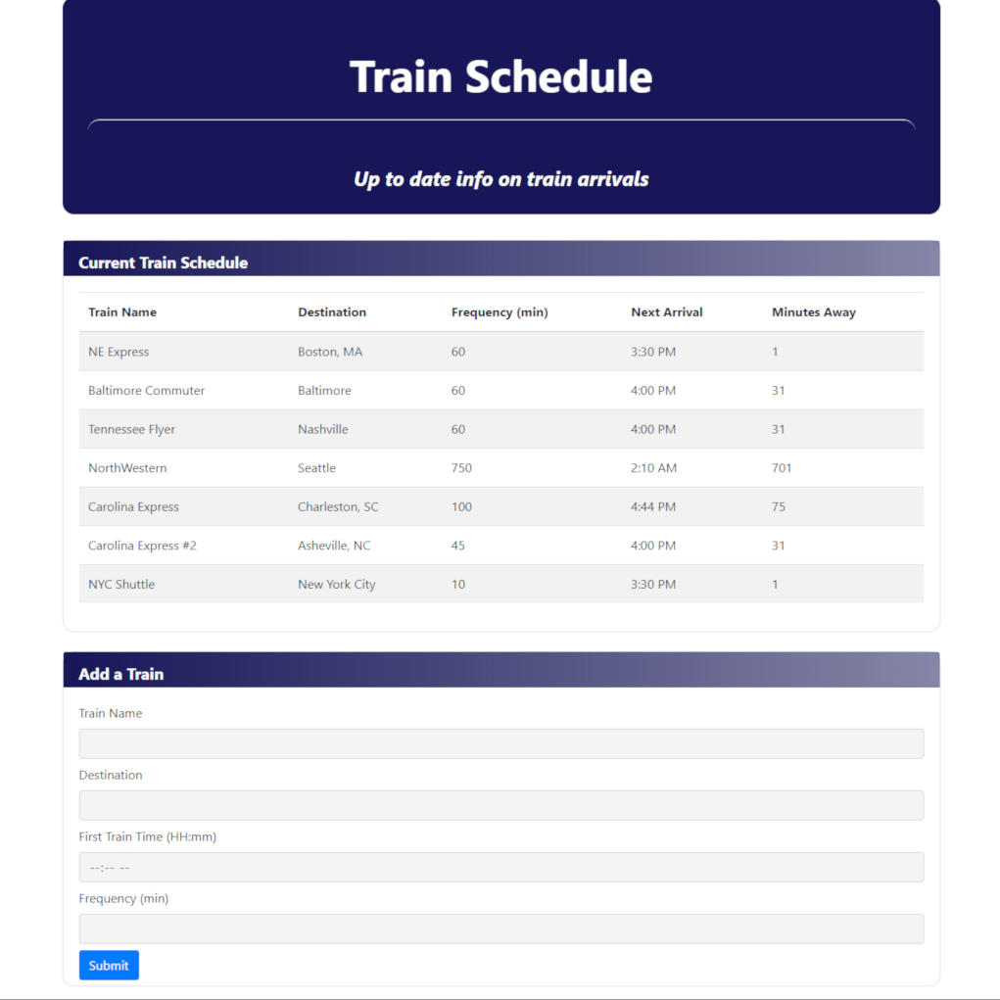

# Train_schedule

**Train Schedule** is a homework assignment that demonstrates data persistence through a Firebase database. For more info on Firebase, check out this link: https://firebase.google.com/. It also makes use of the Moment.js library, which is very useful for accessing and manipulating time. Moment.js is available here: https://momentjs.com/

The user enters the train name, destination, the time of the first train, and the train frequency in minutes.

When the user enters data into **Train Schedule**, it is uploaded to a Firebase database. Submitting another train entry refreshes the data, and the calculated data (Next Arrival and Minutes Away) is updated. Refreshing the web browser will also update the data.

**Train Schedule** was coded by me, and is maintained by me.

The deployed app can be found at https://dirk-kiesewetter.github.io/Train_schedule/

---

**Technical details:**

**Problems:**
Train Schedule needed a way to access the current time, perform calculations and formatting of the time so it was user-readable. In addition, there needed to be a way to persist the data so that it would be current each time the user refreshed the page or added an entry.

**Solutions:**

- Moment.js along with standard JavaScript math operations provided the necessary functionality to access, manipulate, and format time.
- Firebase provided the data persistence.

**Technical Details:**

- Moment.js was used to get the current time, and manipulate and format time for the needed calculations.
- Firebase was used for data persistence.
- Twitter Bootstrap was used for the layout & styling of the page.
- jQuery was used to populate & update the onscreen displays.
