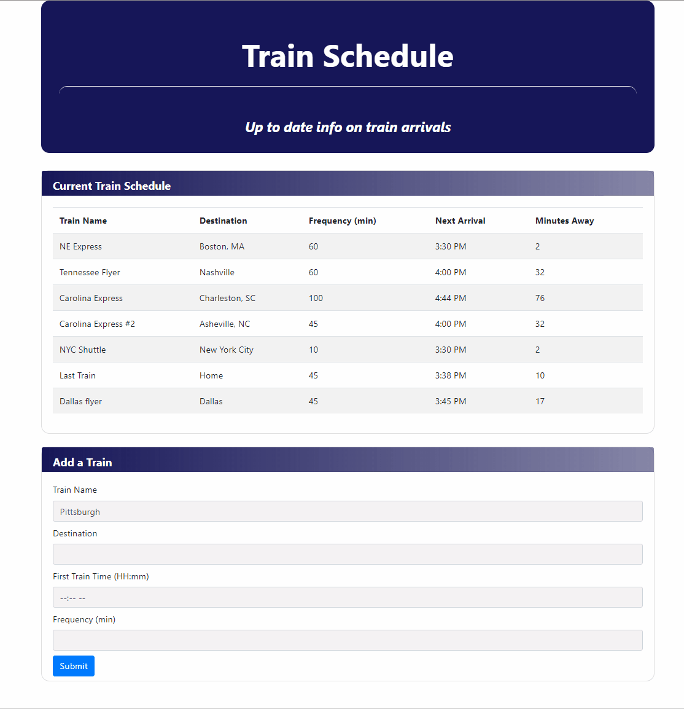

# Train schedule

## [Train schedule deployed app](https://dirk-kiesewetter.github.io/Train_schedule/)

---

## About Train Schedule:

`Train Schedule` demonstrates data persistence through a Firebase database. The user enters the train name, destination, the time of the first train, and the train frequency in minutes.

When the user enters data into `Train Schedule`, it is uploaded to a Firebase database. Submitting another train entry refreshes the data, and the calculated data (Next Arrival and Minutes Away) is updated. Refreshing the web browser will also update the data.

---

## Description of the problem:

`Train Schedule` needed a way to access the current time, perform calculations and formatting of the time so it was user-readable. In addition, there needed to be a way to persist the data so that it would be current each time the user refreshed the page or added an entry.

## Technical Solutions:

- Moment.js along with standard JavaScript math operations provided the necessary functionality to access, manipulate, and format time.
- Firebase provided the data persistence.
- jQuery provided the interaction with HTML elements such as buttons.

---

## How the app is organized:

`Train Schedule` has an HMTL document for structure and the question coding, JavaScript for app logic, functions, and connections to the Firebase database, and CSS for the style.

## How to run `Train Schedule`:

`Train Schedule` can either be run from the hosted site (link is above) or you can download the files to a local directory. If you run it locally, you will need to connect to your own Firebase database, and change the info at lines 3-8 of the script.js file to your database credentials.

## Demo:

## Built with:

- [Bootstrap](https://getbootstrap.com/)
- JavaScript
- [jQuery](https://jquery.com/)
- [Firebase](https://firebase.google.com/)
- [Moment.js](https://momentjs.com/)

## Authors:

`Train Schedule` was coded by me, and is maintained by me.
